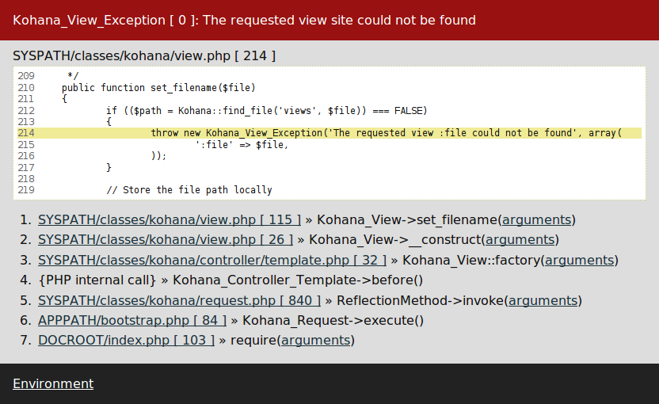

# Hello, World

几乎所有正式的框架都有很棒的'hello world'例子,破坏这江湖规矩是相当不礼貌的

我们将从创建一个非常基础的'hello world',然后再扩展到用MVC模式呈现它.[原文](# We'll start out by creating a very very basic hello world, and then we'll expand it to follow MVC principles.)

## Bare bones

首先我们要创建一个Kohana用来提交请求的控制器.[原文](# First off we have to make a controller that Kohana can use to handle a request.)

在应用程序的目录新建一个'hello.php'文件,键入如下代码(强烈建议手工输入一边,不要直接copy),完整路径应是这样子的'application/classes/controller/hello.php'[原文](# Create the file `application/classes/controller/hello.php` in your application folder and fill it out like so:)

    <?php defined('SYSPATH') OR die('No Direct Script Access');

	Class Controller_Hello extends Controller
	{
		public function action_index()
		{
			echo 'hello, world!';
		}
	}

让我们看看这里发生了什么:[原文](# Lets see what's going on here:)

`<?php defined('SYSPATH') OR die('No Direct Script Access');`
你应该认识第一个标签是PHP开始的意思(如果你不知道的话,最好去http://php.net去了解一些PHP的基本知识).接下来的是Kohana检查当前文件是否在包含在框架内.它阻止某些人直接从URL读取(访问).(# :	You should recognize the first tag as an opening php tag (if you don't you should probably [learn php](http://php.net)).  What follows is a small check that makes sure that this file is being included by Kohana.  It stops people from accessing files directly from the url.)

`Class Controller_Hello extends Controller`
这行声明了我们的控制器,每个控制器类都必须以'Controller_'为前缀,一个下划线限定控制器的文件路径(查看[Conventions and styles](about.conventions)获取更多信息).每个控制器都应承继自一个有标准结构的基类控制器.[原文](# :	This line declares our controller,  each controller class has to be prefixed with `Controller_` and an underscore delimited path to the folder the controller is in (see [Conventions and styles](about.conventions) for more info).  Each controller should also extend the base `Controller` class which provides a standard structure for controllers.)

`public function action_index()`
这个声明了控制器的'index'功能(动作).如果用户没有指定一个功能(动作),Kohana会尝试去使用它--即'index'是每个控制器默认功能(动作).(查看[Routes,URLs and Links](tutorials.urls))[原文](# :	This defines the "index" action of our controller.  Kohana will attempt to call this action if the user hasn't specified an action. (See [Routes, URLs and Links](tutorials.urls)))

`echo 'hello, world!';`
这个是常见的输出语句

现在如果打开浏览器并访问http://localhost/index.php/hello ,你应看到下面的:[原文](# Now if you open your browser and go to http://localhost/index.php/hello you should see something like:)

## That was good, but we can do better

我们在上面的小节所做的是一个很好的例子 创建一个*extremely(非常)*基础的Kohana app 是很容易的.(事实上,它太基础(简单)了,你应永远不会再这么做了!)[原文](# What we did in the previous section was a good example of how easy it to create an *extremely* basic Kohana app. (In fact it's so basic, that you should never make it again!))

如果你有听闻MVC,你很可能意识到直接在控制器中输出内容是完全违背MVC模式原则的.原文](# If you've ever heard anything about MVC you'll probably have realised that echoing content out in a controller is strictly against the principles of MVC.)

使用MVC特有的方式编码,是使用_视图_来操作应用的显示,让控制器做它最擅长的--控制请求流(即逻辑控制)

让我们对原来的控制器作一个小小的改动:[原文](# Lets change our original controller slightly:)

    <?php defined('SYSPATH') OR die('No Direct Script Access');

	Class Controller_Hello extends Controller_Template
	{
		public $template = 'site';

		public function action_index()
		{
			$this->template->message = 'hello, world!';
		}
	}

`extends Controller_Template`
我们现继承模板控制器,这使用得我们的控制器更加方便的使用视图.[原文](# :	We're now extending the template controller,  it makes it more convenient to use views within our controller.)

`public $template = 'site';`
模板控制器需要知道你想使用什么模板.它会自动加载在这里声明的视图,并把视图对象赋值给它.[原文](# :	The template controller needs to know what template you want to use. It'll automatically load the view defined in this variable and assign the view object to it.)

`$this->template->message = 'hello, world!';`
'$this->template'是一个site 模板的视图对象的引用.我们这里所作的就是将一个名为'message',值为'hello world'的变量赋值给视图.[原文](# :	`$this->template` is a reference to the view object for our site template.  What we're doing here is assigning a variable called "message", with a value of "hello, world!" to the view.)

现在让我们运行代码试试...[原文](# Now lets try running our code...)

因为一些原因,Kohana抛出异常,并且没有显示我们令人吃惊的信息(亦或是上文的message变量).[原文](# For some reason Kohana's thrown a wobbly and isn't showing our amazing message.)

如果我们查看错误信息就能看到视图库没能发现我们的site 模板,很有可能我们还没创建它,-*doh*[原文](# If we look at the error message we can see that the View library wasn't able to find our site template, probably because we haven't made it yet – *doh*!)

让我们去为信息(上文的message)创建我们的视图文件,'application/views/site.php'[原文](# Let's go and make the view file `application/views/site.php` for our message:)

	<html>
		<head>
			<title>We've got a message for you!</title>
			
		</head>
		<body>
			<h1><?php echo $message; ?></h1>
			
We just wanted to say it! :)

		</body>
	</html>

如果我们刷新页面就能看到输出的成果:[原文](# If we refresh the page then we can see the fruits of our labour:)

## Stage 3 – Profit!

在这个教程中你已学会如何创建一个控制器并使用视图分离逻辑和显示.[原文](# In this tutorial you've learnt how to create a controller and use a view to separate your logic from your display.)

这个很明显是一个Kohana的非常基础的介绍,甚至没有激发它在你开发应用中的无限潜能.(翻译成Kohana万岁会不会好些.^_^!)[原文](# This is obviously a very basic introduction to working with Kohana and doesn't even scrape the potential you have when developing applications with it.)